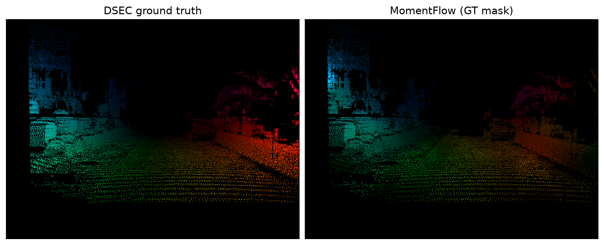
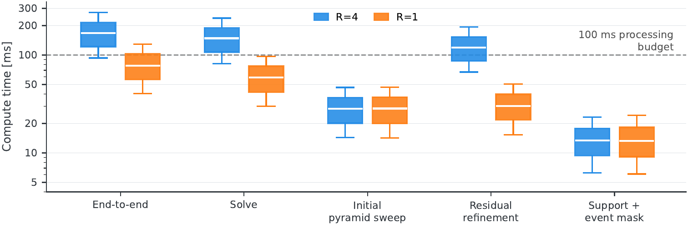

# MomentFlow: Event-Based Optical Flow Using Incremental Spatio-Temporal Moments as an Event-Alignment Surrogate

<p align="center">
  
  
  <a href="https://github.com/IntelligentSystemsLabUTV/moment_flow/releases/latest"></a>
  <a href="https://github.com/IntelligentSystemsLabUTV/moment_flow/blob/master/LICENSE"></a>
</p>

<p align="center">
  Reference implementation as a ROS 2 node.
</p>

<p align="center">
  
</p>

<p align="center">
  <em>One 100 ms window of DSEC <code>thun_00_a</code>.</em>
</p>

MomentFlow summarizes each window of events with local first- and second-order moments on a fixed cell
grid, extracts one normal-flow constraint per cell in closed form, and fuses those constraints over a
coarse-to-fine tile pyramid. There is no learned component and no dataset-specific weight. On the
official [DSEC](https://dsec.ifi.uzh.ch/)-Flow test split it reaches **2.878 px** endpoint error, improving on the full
contrast-maximization reference MultiCM on every reported aggregate metric.

This repository provides the reference C++/ROS 2 implementation, the parameter file of the reported
configuration, and the evaluation, ablation and submission tooling behind the paper's tables. Users of
MomentFlow should cite:

```bibtex
@unpublished{cretu2026momentflow,
  title   = {MomentFlow: Event-Based Optical Flow Using Incremental Spatio-Temporal
             Moments as an Event-Alignment Surrogate},
  author  = {Cretu, Alexandru and Farmani, Jaleh and Tenaglia, Alessandro and
             Masocco, Roberto and Mattogno, Simone and Carnevale, Daniele},
  year    = {2026},
  note    = {Submitted}
}
```

Correspondence: `alexandru.cretu@uniroma2.it`

This guide treats the repository root as the ROS 2 workspace. Run every command below from that
directory unless stated otherwise.

## Table of contents

- [1. Clone the workspace](#1-clone-the-workspace)
- [2. Choose the development environment](#2-choose-the-development-environment)
  - [Option A: install the dependencies in your workspace](#option-a-install-the-dependencies-in-your-workspace)
  - [Python environment](#python-environment)
  - [Option B: use the provided Docker environment](#option-b-use-the-provided-docker-environment)
- [3. Build the workspace](#3-build-the-workspace)
- [4. Launch the node](#4-launch-the-node)
- [5. Configuration parameters](#5-configuration-parameters)
- [6. Results](#6-results)
- [7. Reproducing the paper](#7-reproducing-the-paper)
- [ROS interfaces](#ros-interfaces)
- [Repository layout](#repository-layout)

## 1. Clone the workspace

```bash
git clone https://github.com/IntelligentSystemsLabUTV/moment_flow.git
cd moment_flow
```

## 2. Choose the development environment

The package can be used either in an existing ROS 2 workspace or through the provided Docker
environment. Both options require
[event_camera_msgs](https://github.com/ros-event-camera/event_camera_msgs) and
[event_camera_codecs](https://github.com/ros-event-camera/event_camera_codecs) in the workspace, which
carry the message type the node subscribes to and its decoder. Neither is part of a standard ROS 2
installation, so clone them before continuing:

```bash
git clone https://github.com/ros-event-camera/event_camera_msgs.git \
  src/event_camera_msgs
git clone https://github.com/ros-event-camera/event_camera_codecs.git \
  src/event_camera_codecs
```

```
src/
├── dsec_publisher/        DSEC HDF5 replay node
├── event_camera_codecs/   upstream decoder
├── event_camera_msgs/     upstream message definitions
└── moment_flow/           the estimator and its node
```

On Ubuntu 24.04 `sudo apt install ros-jazzy-event-camera-msgs ros-jazzy-event-camera-codecs` works
instead. `event_camera_codecs` changed the return type of `EventProcessor::eventExtTrigger` between
releases; CMake probes the installed header, so either API builds.

### Option A: install the dependencies in your workspace

This assumes [ROS 2 Jazzy](https://docs.ros.org/en/jazzy/Installation.html) and
[colcon](https://colcon.readthedocs.io/en/released/user/installation.html) are already installed, plus
[rosdep](https://docs.ros.org/en/jazzy/Tutorials/Intermediate/Rosdep.html) initialised
(`sudo rosdep init && rosdep update`). Install:

- [Eigen](https://eigen.tuxfamily.org) 3.4 or newer
- [OpenCV](https://docs.opencv.org/4.x/d7/d9f/tutorial_linux_install.html)
- [OpenMP](https://www.openmp.org/), which comes with GCC
- [Python 3](https://www.python.org/) with
  [virtual environment support](https://docs.python.org/3/library/venv.html)
- `wget` and `unzip`, used by the dataset scripts of Section 7

Then let rosdep resolve the ROS dependencies:

```bash
rosdep install --from-paths src -y --ignore-src
```

### Python environment

`dsec_publisher` and the tooling read DSEC recordings, which are Blosc-compressed HDF5. A virtual
environment with the system packages exposed keeps them isolated while preserving the ROS 2 modules:

```bash
python3 -m venv --system-site-packages .venv
source .venv/bin/activate
python3 -m pip install --upgrade pip
python3 -m pip install h5py hdf5plugin numpy pyyaml
export HDF5_PLUGIN_PATH=$(python3 -c "import hdf5plugin, os; print(os.path.join(os.path.dirname(hdf5plugin.__file__), 'plugins'))")
```

`HDF5_PLUGIN_PATH` is required: without it, opening a sequence fails with
`OSError: Can't read data (filter returned failure)`.

### Option B: use the provided Docker environment

The repository ships four container targets built on
[DUA (Distributed Unified Architecture)](https://github.com/dotX-Automation/dua-template), with the
toolchain and the HDF5 filter plugins already configured:

| Target | For |
| --- | --- |
| `container-x86-dev` | workstation, no GPU |
| `container-x86-cudev` | workstation with CUDA |
| `container-jetson5` | Jetson, JetPack 5 |
| `container-jetson6` | Jetson, JetPack 6 — used for the paper's runtime profile |

It requires
[Docker Engine](https://docs.docker.com/engine/install/ubuntu/), its
[post-installation steps](https://docs.docker.com/engine/install/linux-postinstall) for non-root access,
and the
[NVIDIA Container Toolkit](https://docs.nvidia.com/datacenter/cloud-native/container-toolkit/latest/install-guide.html)
for the CUDA and Jetson targets. The repository root is bind-mounted at `/home/neo/workspace`, so the
host and the container see the same files:

```bash
cd docker/container-x86-cudev/.devcontainer
docker compose up -d --build
docker compose exec moment_flow-x86-cudev zsh
```

On a Jetson, pick the container matching the installed JetPack version. In VS Code, *Dev Containers:
Reopen in Container* on the same directory does the equivalent.

## 3. Build the workspace

```bash
source /opt/ros/jazzy/setup.sh
colcon build --symlink-install --cmake-args -DCMAKE_BUILD_TYPE=RelWithDebInfo
source install/setup.sh
```

## 4. Launch the node

```bash
ros2 launch moment_flow moment_flow.launch.py \
  config:=$(ros2 pkg prefix moment_flow)/share/moment_flow/config/moment_flow.yaml
```

The node is also a composable component, `moment_flow::EventDetector`, and ships a standalone
executable, `moment_flow_app`. Set `autostart: true` to begin on startup, or leave it false and call the
`~/enable` service.

## 5. Configuration parameters

Every parameter carries a full descriptor, so `ros2 param describe /moment_flow <name>` reports its
meaning and range. `config/moment_flow_dsec.yaml` is the reported configuration:

| Parameter | Symbol in the paper | Value |
| --- | --- | --- |
| `max_window_ms` | window duration | 100.0 ms |
| `num_scales` | pyramid levels | 6, so a 32x32 final tile grid |
| `cell_size_px` | cell size | 4 px |
| `aperture_ratio` | aperture threshold | 0.04 |
| `prior_lambda` | prior strength | 0.70, halved per pyramid pass |
| `reg_lambda`, `reg_sweeps`, `reg_sigma` | in-solve coupling | 5.0, 12, 60.0 px/s |
| `smooth_sweeps`, `smooth_beta` | final diffusion | 4, 0.5 |
| `refine_iters` | residual re-warp passes | 4 |
| `max_speed_px_s` | speed clamp | 3000 px/s |

`num_threads` and `max_solve_events` trade cost against nothing else: the first spreads the per-event
stages over OpenMP threads, the second caps the events fed to the solver. `save_enabled` writes the
estimates as DSEC-format 16-bit PNG files, which is how the benchmark submissions were produced.

## 6. Results

| Split | EPE (px) | AE (deg) |
| --- | --- | --- |
| Training, 18 sequences | 2.696 | 11.925 |
| [Test, official DSEC server](https://dsec.ifi.uzh.ch/uzh/dsec-flow-optical-flow-benchmark/momentflow-optim/) | **2.878** | **9.787** |

On the test split the outlier rates are 68.731% (1PE), 40.123% (2PE) and 25.238% (3PE). Against MultiCM
this improves every reported aggregate metric, and EPE on all seven test sequences: 2.878 px against
3.472 px, 9.787 against 13.983 degrees. Among the `optim`-class entries nearest this operating point it
places second by EPE, behind ERTFlow (2.086 px). The ranking is a moving target: see the
[DSEC-Flow leaderboard](https://dsec.ifi.uzh.ch/uzh/dsec-flow-optical-flow-benchmark/) for the
current standings, and the
[MomentFlow entry](https://dsec.ifi.uzh.ch/uzh/dsec-flow-optical-flow-benchmark/momentflow-optim/)
for the per-sequence breakdown.

**Runtime.** On a Jetson AGX Orin (L4T 36.4.4, 50 W, `jetson_clocks` disabled), CPU/OpenMP only, over the
five-sequence subset used for the sensitivity analysis. End-to-end time is measured after the event
window has been formed:

| Configuration | EPE [px] | Median [ms] | P95 [ms] | Within 100 ms |
| --- | --- | --- | --- | --- |
| `refine_iters: 4` (reported) | 2.849 | 167.92 | 272.05 | 7.1% |
| `refine_iters: 1` (reduced) | 3.118 | 78.01 | 129.46 | 71.5% |

<p align="center">
  
</p>

<p align="center">
  <em>Per-stage compute time for the two configurations, log scale. Boxes span the interquartile range,
  whiskers the 5th and 95th percentiles over timed windows; the dashed line is the 100 ms budget.</em>
</p>

The refinement budget dominates: its median cost falls from 119.76 ms to 30.17 ms between the two.
**The reported configuration does not meet a 100 ms budget on this profile**, and the reduced one meets it
on 71.5% of windows: embedded suitability is workload dependent, and the subset is deliberately
event-dense.

## 7. Reproducing the paper

Every table comes from the same loop: replay a DSEC sequence through `dsec_publisher`, run MomentFlow
with `save_enabled`, score the exported PNGs against the ground truth. Point the tooling at your checkout
with `export MOMENTFLOW_WS=/path/to/this/workspace`.

The estimator carries state across windows, so replay each sequence from its beginning.

```bash
# data: the 18 training sequences (needs 15 GiB free), or one test sequence
tools/momentflow_ablation/download_train_split.sh
tools/download_dsec_test_sequence.sh interlaken_00_b

# score one run
python3 -m tools.dsec_flow_benchmark \
  --gt-dir logs/dsec/thun_00_a/optical_flow_forward \
  --pred-dir logs/moment_flow/thun_00_a/dense \
  --pred-units px_per_second --output-json result.json

# component ablation over the full training split
tools/momentflow_ablation/run_all.sh S3 removal
python3 tools/momentflow_ablation/aggregate.py --set S3

# parameter sensitivity over the five-sequence subset, against its own control run
NO_REFERENCE=1 tools/momentflow_ablation/run_all.sh S4 sens
python3 tools/momentflow_ablation/aggregate.py --set S4 --baseline s_ref
```

`variants.py` holds the reported configuration, every variant and the sequence sets, each with the reason
it was chosen; `aggregate.py` pools per-sequence results with paired bootstrap intervals;
`RESULTS_ablation.md` and `RESULTS_sensitivity.md` are the measured tables. `tools/dsec_test_submission/`
builds a submission archive and verifies it before zipping.

## ROS interfaces

| Direction | Name | Type | Contents |
| --- | --- | --- | --- |
| in | `/event_packet` | `event_camera_msgs/EventPacket` | encoded event stream; remap to your driver |
| out | `~/flow_dense` | `sensor_msgs/Image`, `32FC2` | dense image velocity [px/s] |
| out | `~/flow_tiles` | `sensor_msgs/Image`, `32FC2` | velocity on the native tile grid [px/s] |
| out | `~/flow_events` | `sensor_msgs/Image`, `32FC2` | dense flow masked to event-supported pixels |
| out | `~/flow_dense_debug`, `~/flow_tile_debug`, `~/flow_events_debug` | `sensor_msgs/Image`, `BGR8` | HSV visualizations, only when `publish_flow_hsv` is set |
| out | `~/iwe_image` | `sensor_msgs/Image`, `MONO8` | Image of Warped Events, alignment diagnostic |
| service | `~/enable` | `std_srvs/SetBool` | start or stop processing at runtime |

Velocities are physical image velocity: positive is the direction the scene point moves in the image.
`~/flow_dense` and `~/flow_tiles` are always published; `publish_flow_hsv`, `events_enabled` and
`iwe_enabled` add the rest.

## Repository layout

```
src/
├── moment_flow/          ROS 2 package: the estimator and its node
└── dsec_publisher/       ROS 2 node replaying DSEC HDF5 as event packets

tools/
├── dsec_flow_benchmark/  the DSEC flow scorer (EPE, AE, 1PE/2PE/3PE)
├── momentflow_ablation/  component ablation and parameter sensitivity
├── dsec_test_submission/ build and package a benchmark submission
└── download_dsec_*.sh    fetch DSEC sequences

docker/                   four DUA container targets
```

Notes on the package internals are in [`src/moment_flow/README.md`](src/moment_flow/README.md).

## Copyright and License

Copyright 2026 Alexandru Cretu

Licensed under the Apache License, Version 2.0 (the "License"); you may not use this file except in compliance with the License.

You may obtain a copy of the License at <http://www.apache.org/licenses/LICENSE-2.0>.

Unless required by applicable law or agreed to in writing, software distributed under the License is distributed on an "AS IS" BASIS, WITHOUT WARRANTIES OR CONDITIONS OF ANY KIND, either express or implied.

See the License for the specific language governing permissions and limitations under the License.
