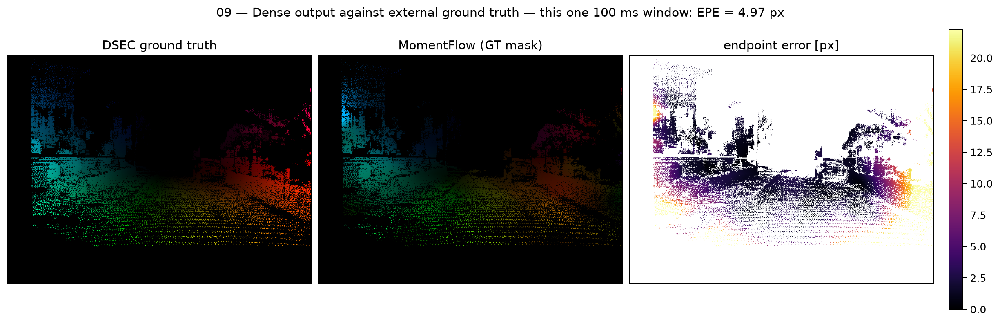
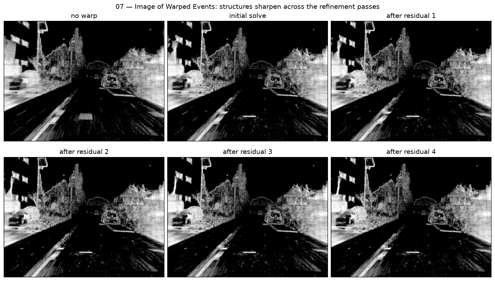

# MomentFlow: Dense Optical Flow from Spatio-Temporal Moments

<p align="center">
  
  
  
  
  <a href="https://github.com/IntelligentSystemsLabUTV/moment_flow/releases/latest"></a>
  <a href="https://github.com/IntelligentSystemsLabUTV/moment_flow/blob/master/LICENSE"></a>
</p>

<p align="center">
  Training-free event-based optical flow that replaces iterative contrast maximization with an incremental moment surrogate.
</p>

<p align="center">
  
</p>

<p align="center">
  <em>One 100 ms window of DSEC <code>thun_00_a</code>: ground truth, the MomentFlow field masked to the
  ground-truth pixels, and the per-pixel endpoint error.</em>
</p>

MomentFlow summarizes each window of events with local first- and second-order moments on a fixed cell
grid, extracts one normal-flow constraint per cell in closed form, and fuses those constraints over a
coarse-to-fine tile pyramid. It is **training-free**: there is no learned component and no
dataset-specific weight. On the official DSEC-Flow test split it reaches **2.878 px** endpoint error and
**9.787 degrees** angular error, improving over the full contrast-maximization reference MultiCM on every
reported aggregate metric.

The estimator is stateful across windows and runs on embedded hardware on CPU alone, with no CUDA or GPU
acceleration; its latency is workload dependent, so read [Results](#7-results) before assuming a
processing budget.

This repository accompanies the paper below and contains the reference C++/ROS 2 implementation, the
parameter file of the reported configuration, and the evaluation, ablation and submission tooling used to
produce its tables. Users of MomentFlow should cite:

```bibtex
@article{cretu2026momentflow,
  title   = {MomentFlow: Event-Based Optical Flow Using Incremental Spatio-Temporal
             Moments as an Event-Alignment Surrogate},
  author  = {Cretu, Alexandru and Farmani, Jaleh and Tenaglia, Alessandro and
             Masocco, Roberto and Mattogno, Simone and Carnevale, Daniele},
  journal = {Sensors},
  year    = {2026},
  note    = {Submitted}
}
```

Correspondence: `alexandru.cretu@uniroma2.it`

This guide treats the repository root as the ROS 2 workspace. Run every command below from that
directory unless stated otherwise.

## Table of contents

- [1. Clone the repository](#1-clone-the-repository)
- [2. Prerequisites](#2-prerequisites)
  - [Event-camera packages](#event-camera-packages)
  - [HDF5 filter plugins](#hdf5-filter-plugins)
  - [Tools used by the reproduction scripts](#tools-used-by-the-reproduction-scripts)
- [3. Choose the development environment](#3-choose-the-development-environment)
  - [Option A: install the dependencies in your workspace](#option-a-install-the-dependencies-in-your-workspace)
  - [Option B: use the provided DUA environment](#option-b-use-the-provided-dua-environment)
- [4. Build the workspace](#4-build-the-workspace)
- [5. Launch the node](#5-launch-the-node)
- [6. Configuration parameters](#6-configuration-parameters)
- [7. Results](#7-results)
  - [Runtime](#runtime)
- [8. Reproducing the paper](#8-reproducing-the-paper)
- [ROS interfaces](#ros-interfaces)
- [Repository layout](#repository-layout)

## 1. Clone the repository

```bash
git clone https://github.com/IntelligentSystemsLabUTV/moment_flow.git
cd moment_flow
```

There are no submodules: the two ROS 2 packages are in `src/` already.

## 2. Prerequisites

ROS 2 **Jazzy** on Linux, plus `colcon` and `rosdep`. On a machine that has never built a ROS 2
workspace:

```bash
sudo apt install python3-colcon-common-extensions python3-rosdep
sudo rosdep init          # only once per machine
rosdep update
```

`moment_flow` itself depends only on `rclcpp`, `rcl_interfaces`, `sensor_msgs`, `std_msgs`, `std_srvs`,
`rclcpp_components`, Eigen 3.4, OpenCV and OpenMP. `dsec_publisher` additionally needs `rclpy`,
`tf2_ros`, `h5py`, NumPy and PyYAML. Everything in that list is resolved by

```bash
rosdep install --from-paths src -y --ignore-src
```

with the two exceptions below, which `rosdep` cannot provide.

### Event-camera packages

The node consumes `event_camera_msgs/msg/EventPacket` and decodes it with `event_camera_codecs`.
**Neither package is part of a standard ROS 2 installation and neither is provided by this
repository**; install them from upstream:

- [`ros-event-camera/event_camera_msgs`](https://github.com/ros-event-camera/event_camera_msgs)
- [`ros-event-camera/event_camera_codecs`](https://github.com/ros-event-camera/event_camera_codecs)

On Ubuntu 24.04 the released Debian packages are enough:

```bash
sudo apt install ros-jazzy-event-camera-msgs ros-jazzy-event-camera-codecs
```

On any other release, or to pin a specific revision, clone them into `src/` and let `colcon` build them
along with this workspace:

```bash
git clone https://github.com/ros-event-camera/event_camera_msgs.git   src/event_camera_msgs
git clone https://github.com/ros-event-camera/event_camera_codecs.git src/event_camera_codecs
```

`event_camera_codecs` changed the return type of `EventProcessor::eventExtTrigger` between releases.
CMake probes the header that is actually installed and adapts, so either API builds without
intervention.

### HDF5 filter plugins

DSEC recordings are Blosc-compressed HDF5. `h5py` needs the external filter plugins to read them, and
`HDF5_PLUGIN_PATH` has to point at the directory that holds them:

```bash
pip install hdf5plugin        # on Ubuntu 24.04 add --break-system-packages, or use a venv
export HDF5_PLUGIN_PATH=$(python3 -c "import hdf5plugin, os; print(os.path.join(os.path.dirname(hdf5plugin.__file__), 'plugins'))")
```

Without this, opening a sequence fails with `OSError: Can't read data (filter returned failure)` or a
missing-plugin-directory error. Option B below ships both already configured.

### Tools used by the reproduction scripts

The dataset scripts of Section 8 call `wget` and `unzip`, and abort if either is missing:

```bash
sudo apt install wget unzip
```

The full 18-sequence training split needs a good deal of room: `download_train_split.sh` refuses to
continue with less than **15 GiB** free, because the largest sequence needs about 10 GiB transiently for
the archive plus its extracted contents.

## 3. Choose the development environment

### Option A: install the dependencies in your workspace

Follow Section 2 on the host: ROS 2 Jazzy, `colcon`, `rosdep`, the two event-camera packages,
`hdf5plugin`, and `wget`/`unzip` if you intend to reproduce the paper. Then go straight to
[Build the workspace](#4-build-the-workspace).

This is the lightest path and the one to use when the machine already carries a ROS 2 Jazzy
installation.

### Option B: use the provided DUA environment

The repository ships four [DUA](https://github.com/dotX-Automation/dua-template) container targets, so
the whole toolchain comes preconfigured, including the HDF5 filter plugins and `HDF5_PLUGIN_PATH`:

| Target | Base | For |
| --- | --- | --- |
| `container-x86-dev` | `dua-foundation:x86-dev` | workstation, no GPU |
| `container-x86-cudev` | `dua-foundation:x86-cudev` | workstation with CUDA |
| `container-jetson5` | `dua-foundation:jetson5` | Jetson, JetPack 5 |
| `container-jetson6` | `dua-foundation:jetson6` | Jetson, JetPack 6 — the target used for the paper's runtime profile |

It needs Docker Engine, and the NVIDIA Container Toolkit for the CUDA and Jetson targets. Each target is
a self-contained devcontainer: the repository root is bind-mounted at `/home/neo/workspace`, so the host
and the container see the same files.

```bash
cd docker/container-x86-cudev/.devcontainer
docker compose up -d                              # the first run builds the image, which takes a while
docker compose exec moment_flow-x86-cudev zsh     # open a shell in the workspace
```

The service is named `moment_flow-<target>` in every target. In VS Code, *Dev Containers: Reopen in
Container* on the same directory does the equivalent.

The event-camera packages of Section 2 are **not** baked into the images: clone them into `src/` as shown
above, and `colcon` will build them inside the container.

Python differs across the bases — 3.12 on the x86 targets, 3.10 on `jetson6`, 3.8 on `jetson5` — so pip
may resolve older `h5py` and `hdf5plugin` wheels on `jetson5`. That combination is untested here.

## 4. Build the workspace

```bash
source /opt/ros/jazzy/setup.sh
colcon build --symlink-install --cmake-args -DCMAKE_BUILD_TYPE=RelWithDebInfo
source install/setup.sh
```

The same three commands work unchanged inside any of the containers of Option B.

## 5. Launch the node

```bash
ros2 launch moment_flow moment_flow.launch.py \
  config:=$(ros2 pkg prefix moment_flow)/share/moment_flow/config/moment_flow.yaml
```

The node is also a composable component, `moment_flow::EventDetector`, and ships a standalone
executable, `moment_flow_app`. Set `autostart: true` to begin on startup, or leave it false and call the
`~/enable` service when you want processing to start.

## 6. Configuration parameters

Every parameter is declared with a full descriptor, so `ros2 param describe /moment_flow <name>` reports
its meaning, its admissible range and whether it is fixed after startup.
`config/moment_flow_dsec.yaml` is the authoritative record of the configuration reported in the paper;
its principal algorithmic values are:

| Parameter | Symbol in the paper | Value |
| --- | --- | --- |
| `max_window_ms` | window duration | 100.0 ms |
| `num_scales` | pyramid levels | 6, so a 32x32 final tile grid |
| `cell_size_px` | cell size | 4 px |
| `aperture_ratio` | aperture threshold | 0.04 |
| `prior_lambda` | prior strength | 0.70, halved per pyramid pass |
| `reg_lambda`, `reg_sweeps`, `reg_sigma` | in-solve coupling | 5.0, 12, 60.0 px/s |
| `smooth_sweeps`, `smooth_beta` | final diffusion | 4, 0.5 |
| `refine_iters` | residual re-warp passes | 4 |
| `max_speed_px_s` | speed clamp | 3000 px/s |

Residual re-warping is the mechanism that keeps the linear moment model inside its small-displacement
regime: each pass compensates the events by the field composed so far and re-solves, which sharpens the
warped-event cloud.

<p align="center">
  
</p>

<p align="center">
  <em>The Image of Warped Events over the same window, from unwarped events through the initial solve and
  the four residual passes of the reported configuration.</em>
</p>

Two knobs matter for cost rather than accuracy: `num_threads` spreads the per-event stages over OpenMP
threads, and `max_solve_events` caps the events fed to the solver by uniform striding, rescaling the mass
gates accordingly. The reported configuration leaves the cap disabled.

Setting `save_enabled` writes the estimates as DSEC-format 16-bit PNG files, optionally aligned to a
ground-truth timestamp schedule, which is how the benchmark submissions were produced.

## 7. Results

On the **official DSEC-Flow test split**, evaluated by the benchmark server:

| EPE (px) | AE (deg) | 1PE (%) | 2PE (%) | 3PE (%) |
| --- | --- | --- | --- | --- |
| **2.878** | **9.787** | 68.731 | 40.123 | 25.238 |

On the 18-sequence **training split** with the same configuration: EPE 2.696 px, AE 11.925 degrees.

Relative to MultiCM, the full contrast-maximization reference, MomentFlow improves every reported
aggregate metric and improves EPE on every one of the seven test sequences: 2.878 px against 3.472 px
EPE, and 9.787 against 13.983 degrees AE.

Among the `optim`-class leaderboard entries closest to this operating point it places second by EPE,
ahead of MultiCM (3.472 px) and RTEF (4.881 px) and behind ERTFlow (2.086 px, an anonymous entry marked
"under review"). The paper compares a deliberately restricted set of optimization-based and CMax-related
methods rather than the complete leaderboard.

### Runtime

Profiled on an NVIDIA Jetson AGX Orin Developer Kit (L4T 36.4.4, ROS 2 Jazzy, 50 W power mode,
`jetson_clocks` disabled), CPU/OpenMP only, over the same five-sequence subset used for the parameter
sensitivity. End-to-end time measures computation after the event window has been formed, and excludes
the 100 ms of event support the window spans.

| Configuration | EPE [px] | Median [ms] | P95 [ms] | Within 100 ms | Throughput [Mev/s] |
| --- | --- | --- | --- | --- | --- |
| `refine_iters: 4` (reported) | 2.849 | 167.92 | 272.05 | 7.1% | 9.54 |
| `refine_iters: 1` (reduced) | 3.118 | 78.01 | 129.46 | 71.5% | 20.13 |

The residual-refinement budget dominates: its median cost falls from 119.76 ms to 30.17 ms between the
two, while the initial sweep (28.4 ms) and the support and event masks (13.3 ms) are effectively
unchanged. Trading 0.269 px of EPE for `refine_iters: 1` therefore roughly halves median and P95 latency.

**On this profile the reported configuration does not meet a 100 ms budget**, and the reduced-refinement
configuration meets it on 71.5% of windows. Embedded suitability is workload dependent rather than
guaranteed; the five-sequence subset is deliberately event-dense. See the paper for the stage
distributions.

## 8. Reproducing the paper

Everything needed to reproduce the reported tables is in this repository. All of it drives the same loop:
replay a DSEC sequence through `dsec_publisher`, run MomentFlow with `save_enabled`, and score the
exported PNGs against the ground truth.

The tooling defaults to the workspace paths used for the published runs. Point it at your own checkout
with

```bash
export MOMENTFLOW_WS=/path/to/this/workspace
```

### Get the data

```bash
tools/momentflow_ablation/download_train_split.sh      # the 18 training sequences
tools/download_dsec_test_sequence.sh interlaken_00_b   # one test sequence
```

Sequences land under `logs/dsec/<sequence>/`, the layout the run scripts expect. Set `DSEC_ROOT` to put
them elsewhere.

### Score a single run

`tools/dsec_flow_benchmark/` is the scorer: EPE, AE and 1PE/2PE/3PE under the DSEC global valid-pixel
aggregation, with ground-truth matching by name, order or timestamp.

```bash
python3 -m tools.dsec_flow_benchmark \
  --gt-dir   logs/dsec/thun_00_a/optical_flow_forward \
  --pred-dir logs/moment_flow/thun_00_a/dense \
  --pred-units px_per_second --output-json result.json
python3 -m tools.dsec_flow_benchmark.self_test   # unit tests for the metrics and IO
```

### Component ablation and parameter sensitivity

| File | Purpose |
| --- | --- |
| `variants.py` | the reported configuration, every ablation and sensitivity variant, and the sequence sets, each with the reason it was chosen |
| `run_variant.sh` | replay one sequence under one variant and score it |
| `run_all.sh` | drive the whole campaign |
| `aggregate.py` | pool per-sequence results, paired per-frame bootstrap intervals |
| `BASELINE_moment_flow_dsec.yaml` | frozen copy of the reported configuration used by the campaign |
| `RESULTS_ablation.md`, `RESULTS_sensitivity.md` | the measured tables behind the paper |

`run_all.sh` takes a sequence set (`S1`--`S4`) or a single sequence name, followed by the tiers to sweep.
`aggregate.py` then pools whatever has been scored:

```bash
# component ablation over the full 18-sequence training split
tools/momentflow_ablation/run_all.sh S3 removal
python3 tools/momentflow_ablation/aggregate.py --set S3

# parameter sensitivity over the five-sequence subset, against its own control run
NO_REFERENCE=1 tools/momentflow_ablation/run_all.sh S4 sens
python3 tools/momentflow_ablation/aggregate.py --set S4 --baseline s_ref
```

Every delta is measured against `--baseline`, and the sensitivity sweep names its own same-session
control (`s_ref`) rather than a reference scored earlier: event delivery is load-dependent, so comparing
across sessions folds run-to-run noise into the parameter effect.

The sensitivity subset is deliberately harder than the full split: pooled EPE 2.849 px against 2.73 px
for the ablation baseline. `variants.py` records why each of its five sequences was chosen.

### Test-set submission

`tools/dsec_test_submission/` produces a submission archive: `make_configs.py` imports the reported
configuration from `variants.py` so the submitted settings cannot drift from the ablation baseline,
`run_test_sequence.sh` replays one sequence against the official timestamp schedule, and
`package_submission.py` verifies the result — seven directories, the expected file counts, six-digit
names, and the 16-bit three-channel PNG header — before zipping it.

### One thing to know before re-running

The estimator carries state across windows, so a sequence is not a set of independent frames: results
depend on the recency of the tracked field. Replay each sequence from its beginning.

## ROS interfaces

| Direction | Name | Type | Contents |
| --- | --- | --- | --- |
| in | `/event_packet` | `event_camera_msgs/EventPacket` | encoded event stream; remap to your driver |
| out | `~/flow_dense` | `sensor_msgs/Image`, `32FC2` | dense image velocity [px/s] |
| out | `~/flow_tiles` | `sensor_msgs/Image`, `32FC2` | velocity on the native tile grid [px/s] |
| out | `~/flow_events` | `sensor_msgs/Image`, `32FC2` | dense flow masked to event-supported pixels |
| out | `~/flow_dense_debug`, `~/flow_tile_debug`, `~/flow_events_debug` | `sensor_msgs/Image`, `BGR8` | HSV flow visualizations, only when `publish_flow_hsv` is set |
| out | `~/iwe_image` | `sensor_msgs/Image`, `MONO8` | Image of Warped Events, alignment diagnostic |
| service | `~/enable` | `std_srvs/SetBool` | start or stop processing at runtime |

Velocities follow the physical convention: positive is the direction the scene point moves in the image.

The numeric fields `~/flow_dense` and `~/flow_tiles` are the node's output and are always published.
`publish_flow_hsv` adds the three BGR8 HSV renderings, which exist only for visualization;
`events_enabled` adds the event-supported pair; `iwe_enabled` adds the IWE diagnostic. The dense and
event-supported HSV renderings are also only computed when `debug` is set, so with `debug: false` only
`~/flow_tile_debug` carries an image.

## Repository layout

```
src/
├── moment_flow/                     ROS 2 package: the estimator and its node
│   ├── include/moment_flow/
│   │   ├── moment_flow_solver.hpp        solver API (pimpl)
│   │   ├── event_detector.hpp            node class
│   │   ├── event_store.hpp               internal event representation
│   │   └── parameter_manager.hpp         parameter declaration with descriptors
│   ├── src/moment_flow/
│   │   ├── moment_flow_solver.cpp        the estimator: moments, tile fusion, coupling
│   │   ├── optical_flow.cpp              window solve, re-warping, diffusion, rendering
│   │   ├── workers.cpp                   windowing and the benchmark export schedule
│   │   └── ...                           node scaffolding, one concern per file
│   ├── config/
│   │   ├── moment_flow_dsec.yaml         the reported DSEC configuration
│   │   └── moment_flow.yaml              live-camera configuration
│   └── launch/moment_flow.launch.py
└── dsec_publisher/                  ROS 2 node replaying DSEC HDF5 as event packets

tools/
├── download_dsec_sequence.sh        fetch one DSEC training sequence
├── download_dsec_test_sequence.sh   fetch one DSEC test sequence
├── dsec_flow_benchmark/             the DSEC flow scorer (EPE, AE, 1PE/2PE/3PE)
├── momentflow_ablation/             component ablation and parameter sensitivity
└── dsec_test_submission/            build and package a benchmark submission

docker/                              four DUA container targets
docs/img/                            figures used by this README
```

Developer-facing notes on the package internals are in
[`src/moment_flow/README.md`](src/moment_flow/README.md).

## Copyright and License

Copyright 2026 Alexandru Cretu

Licensed under the Apache License, Version 2.0 (the "License"); you may not use this file except in compliance with the License.

You may obtain a copy of the License at <http://www.apache.org/licenses/LICENSE-2.0>.

Unless required by applicable law or agreed to in writing, software distributed under the License is distributed on an "AS IS" BASIS, WITHOUT WARRANTIES OR CONDITIONS OF ANY KIND, either express or implied.

See the License for the specific language governing permissions and limitations under the License.
