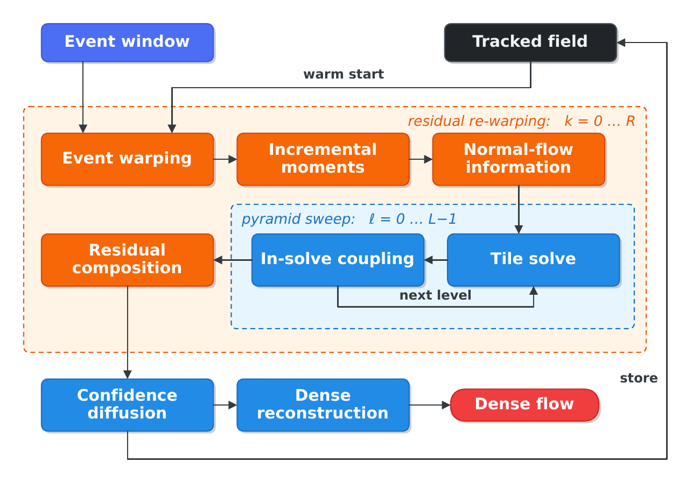

# `moment_flow`

ROS 2 package implementing MomentFlow: dense event-based optical flow from incremental spatio-temporal moments.

The user-facing documentation — results, dependencies, build, node interface, parameters and how to reproduce the paper — is in the [repository README](../../README.md). This file covers what a developer opening the package needs.

## Structure

The estimator and the node are deliberately separate. `moment_flow::flow::MomentFlow` is a plain class that never touches the ROS graph; `moment_flow::EventDetector` owns it and does all the ROS work.

<p align="center">
  
</p>

<p align="center">
  <em>Data flow inside the estimator. The pyramid sweep runs over <code>pyramid_levels</code> levels and
  the re-warping loop over at most <code>refine_iters</code> iterations; the tracked field is the state
  carried across windows.</em>
</p>

| File | Concern |
| --- | --- |
| `include/moment_flow/moment_flow_solver.hpp` | solver API: `Events`, `MomentFlowParams`, `MomentFlowProfile`, `MomentFlow` (pimpl) |
| `src/moment_flow/moment_flow_solver.cpp` | the estimator: cell moments, normal-flow constraints, tile fusion, in-solve coupling |
| `src/moment_flow/optical_flow.cpp` | one window: event selection and packing, the solve, residual re-warping, final diffusion, dense reconstruction, rendering |
| `include/moment_flow/event_detector.hpp` | node class declaration |
| `src/moment_flow/moment_flow.cpp` | constructor, callback groups, publishers, subscribers, service servers |
| `src/moment_flow/subscriptions.cpp` | event-packet callback: decode and hand off, no processing |
| `src/moment_flow/workers.cpp` | worker thread: windowing, publishing, the benchmark export schedule |
| `src/moment_flow/service_servers.cpp` | `~/enable` |
| `src/moment_flow/stream_discontinuity.cpp` | state reset after a backward timestamp jump |
| `src/moment_flow/utils.cpp` | activate/deactivate, timing log, DSEC PNG export, image publishing |
| `src/moment_flow/init_parameters.cpp` | the 37 parameter declarations |
| `src/moment_flow/parameter_manager.cpp` | declares parameters with descriptors and mirrors them into members |

## Invariants worth knowing before changing anything

**The estimator is stateful across windows.** The final tile field of each window is kept as the tracked field and warm-starts the next one, and the events of a window are compensated by it before the first pyramid pass. A window is therefore not reproducible in isolation, and any change to window boundaries changes results downstream.

**Two sign conventions.** The solver stores a warp field `F` such that `x' = x + t*F(x)`. Published and exported flow is the physical image velocity `v = -F`, converted once at the output boundary. Inside the solver, `fb_px = -fb_Fx` conversions appear wherever a fallback crosses that boundary.

**Threading.** The subscription callback only decodes and enqueues; all processing happens on the single worker thread, which is why the processors need no locking. The queue is bounded and drops the oldest chunk when live, but never drops while `save_enabled` is set, so benchmark exports stay complete.

**Parameters are mirrored, not polled.** `ParameterManager` writes each declared parameter into a member at declaration and on every accepted update. Read the member; do not call `get_parameter` on a hot path. Startup-only values are declared `read_only`, so rclcpp rejects attempts to change them.

## Development

```bash
colcon build --symlink-install --packages-select moment_flow \
  --cmake-args -DCMAKE_BUILD_TYPE=RelWithDebInfo
colcon test --packages-select moment_flow && colcon test-result --verbose
```

`cpplint` and `ament_copyright` are disabled in `CMakeLists.txt`, each with the reason stated there: neither can pass given this file layout and license-header format, and both would otherwise mask real findings. Everything else — `uncrustify`, `cppcheck`, `lint_cmake`, `xmllint`, `pep257` — passes.

`ament_flake8` is left enabled but crashes on some environments with `argparse.ArgumentError: argument --application-import-names: conflicting option string`. That is a clash between `ament-flake8` and a newer `flake8-import-order` in the installed environment, not a defect in this package: it reproduces on unrelated packages in the same environment. `ament_pep257` covers the one Python file here.

## Copyright and License

Copyright 2026 Alexandru Cretu

Licensed under the Apache License, Version 2.0 (the "License"); you may not use this file except in compliance with the License.

You may obtain a copy of the License at <http://www.apache.org/licenses/LICENSE-2.0>.

Unless required by applicable law or agreed to in writing, software distributed under the License is distributed on an "AS IS" BASIS, WITHOUT WARRANTIES OR CONDITIONS OF ANY KIND, either express or implied.

See the License for the specific language governing permissions and limitations under the License.
